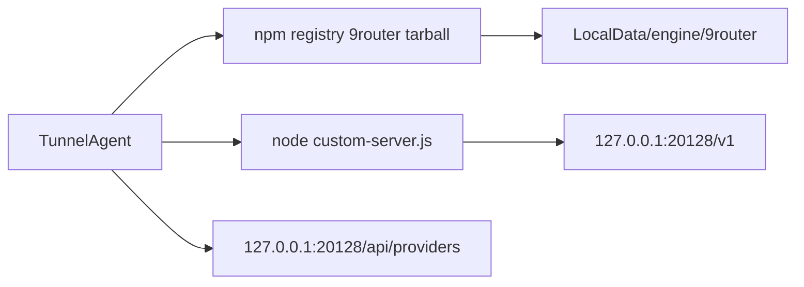

# 9Router engine integration

Phased plan to add [9Router](https://github.com/decolua/9router) as a third managed engine, alongside CLIProxyAPI and Perplexity WebUI Scraper.

**Constraint:** later chats have a small context window (~256k). Implement **one phase per chat**, in that phase’s git worktree only. Load this file plus the phase’s **Load** list. Do not start the next phase in the same chat.

**Stack:**

```
(main) <- 9router/00-plan <- 9router/01-catalog-node <- 9router/02-npm-download
       <- 9router/03-process <- 9router/04-engine-registry <- 9router/05-config-ui
       <- 9router/06-config-i18n <- 9router/07-api-client <- 9router/08-providers-tab
       <- 9router/09-tray-sidebar-i18n <- 9router/10-oauth <- 9router/11-agents-docs
```

---

## Worktrees and stacked PRs

Every phase lives in its **own git worktree** and is one **layer of a `gh stack`**. Reviewers see only that phase’s diff. Foundational work is at the bottom and merges first.

### Locations

| Phase | Branch | Worktree |
| --- | --- | --- |
| 0 | `9router/00-plan` | `../worktrees/9router-00-plan` |
| 1 | `9router/01-catalog-node` | `../worktrees/9router-01-catalog-node` |
| 2 | `9router/02-npm-download` | `../worktrees/9router-02-npm-download` |
| 3 | `9router/03-process` | `../worktrees/9router-03-process` |
| 4 | `9router/04-engine-registry` | `../worktrees/9router-04-engine-registry` |
| 5 | `9router/05-config-ui` | `../worktrees/9router-05-config-ui` |
| 6 | `9router/06-config-i18n` | `../worktrees/9router-06-config-i18n` |
| 7 | `9router/07-api-client` | `../worktrees/9router-07-api-client` |
| 8 | `9router/08-providers-tab` | `../worktrees/9router-08-providers-tab` |
| 9 | `9router/09-tray-sidebar-i18n` | `../worktrees/9router-09-tray-sidebar-i18n` |
| 10 | `9router/10-oauth` | `../worktrees/9router-10-oauth` |
| 11 | `9router/11-agents-docs` | `../worktrees/9router-11-agents-docs` |

Worktree paths are siblings of the main clone, under `repositories/worktrees/`. The main clone stays on `main`.

### Start a phase (after the previous phase is committed)

Do **not** run `gh stack add` inside an older worktree — it would check out the new branch there and collide with the new worktree.

From the **previous** phase worktree (already committed):

```pwsh
$parent = "9router/0N-previous-slug"
$branch = "9router/0M-this-slug"
$path   = "C:\Users\mikel\development\personal\projects\tunnel-agent\repositories\worktrees\$($branch.Replace('/','-'))"

git worktree add -b $branch $path $parent
```

Then move the agent root to `$path` and implement only this phase.

When the phase is committed, from **this new (top) worktree**, adopt the full chain and open/update stacked PRs:

```pwsh
gh stack init --base main `
  9router/00-plan `
  9router/01-catalog-node `
  9router/02-npm-download `
  9router/03-process `
  9router/04-engine-registry `
  9router/05-config-ui `
  9router/06-config-i18n `
  9router/07-api-client `
  9router/08-providers-tab `
  9router/09-tray-sidebar-i18n `
  9router/10-oauth `
  9router/11-agents-docs

gh stack submit --auto --remote origin
```

Pass only the branches that already exist. `init` adopts existing branches and checks out the last one (already checked out in the top worktree). Always pass `--remote origin`. Never run bare `gh stack submit` (it opens a TUI). After submit, `gh pr edit` if the auto title needs a better summary.

If a lower layer must change after a higher layer exists: check out that lower worktree, commit there, then from the **top** worktree run `gh stack rebase --upstack` and `gh stack submit --auto --remote origin`.

### Phase 0 bootstrap (this layer)

```pwsh
git worktree add -b 9router/00-plan ..\worktrees\9router-00-plan main
# write docs/plan/2026-08-14-9router-engine.md, commit
gh stack init --base main 9router/00-plan
gh stack submit --auto --remote origin
```

---

## How existing engines work

Both engines implement [`IManagedEngine`](../../src/TunnelAgent.Core/Engine/IManagedEngine.cs) and register in [`EngineRegistryService`](../../src/TunnelAgent.Infrastructure/Engine/EngineRegistryService.cs). Definitions live in [`EngineCatalog`](../../src/TunnelAgent.Core/Engine/EngineCatalog.cs). Settings are seeded in [`SettingsService`](../../src/TunnelAgent.Infrastructure/Services/SettingsService.cs) via `EngineRuntimeSettings` (port, AutoStart, PreferredVersion).

| Engine | Install | Process | Accounts |
| --- | --- | --- | --- |
| CLIProxyAPI | GitHub zip → native exe | spawn exe `-config` | Tunnel Agent writes `proxy-config.yaml` |
| Perplexity | GitHub zip → native exe | spawn exe `api --port` | JSON files + env token |
| **9Router (new)** | **npm tarball → Node app** | spawn `node …/app/custom-server.js` | **HTTP `/api/providers` while running** |

Closest code to copy: Perplexity’s thin [`EngineService`](../../src/TunnelAgent.Infrastructure/Engine/Perplexity/EngineService.cs) + [`DownloadService`](../../src/TunnelAgent.Infrastructure/Engine/Perplexity/DownloadService.cs) + [`ProcessService`](../../src/TunnelAgent.Infrastructure/Engine/Perplexity/ProcessService.cs).

Do **not** copy:

- CLIProxy GitHub-asset naming
- `FallbackProxyService`
- `ConfigService` YAML
- `/v0/management/*` logs/usage
- `IPlatformInfo` native-binary fields (`PerplexityBinaryName` / asset suffixes)

9Router is Node + npm, not a GitHub exe.

UI today is hardcoded dual-engine (`IsCliProxyEngineSelected` / `IsPerplexityEngineSelected` in [`MainWindowViewModel.cs`](../../src/TunnelAgent.Avalonia/ViewModels/MainWindowViewModel.cs), tabs in [`ProvidersView.axaml`](../../src/TunnelAgent.Avalonia/Views/ProvidersView.axaml) / [`ConfigurationView.axaml`](../../src/TunnelAgent.Avalonia/Views/ConfigurationView.axaml), sidebar in [`MainWindow.axaml`](../../src/TunnelAgent.Avalonia/Views/MainWindow.axaml), tray in [`TrayService.cs`](../../src/TunnelAgent.Avalonia/Services/TrayService.cs)). New engine follows the same pattern (third tab / third status card). Do not refactor to a generic engine UI in v1.



---

## Binary reality (do not compile a native exe)

GitHub releases for [decolua/9router](https://github.com/decolua/9router) only ship source archives. The real artifact is the npm package [9router](https://www.npmjs.com/package/9router) (0.5.55 at plan time): a Node CLI plus a **prebuilt Next.js standalone** under `app/`.

- `npm run build` in the git repo still produces a Node server, not `9router.exe`.
- `cli.js` is a launcher (TTY menu, auto-update, tray, `killProcessOnPort`, default bind `0.0.0.0`). When there is no TTY it forces tray mode. **Do not spawn `cli.js`.**
- Spawn the standalone server the same way `cli.js` does:

```
node --dns-result-order=ipv4first --max-old-space-size=6144 <engineDir>/app/custom-server.js
cwd: <engineDir>/app
env: PORT=<port>, HOSTNAME=127.0.0.1
```

After extract, run `node <engineDir>/hooks/postinstall.js` once so SQLite runtime lands in `%APPDATA%/9router/runtime` (or `~/.9router/runtime`). `cli.js` would self-heal this; we skip `cli.js`.

**Node.js >= 18 must be on PATH** (or a well-known install path). If missing, engine state is `NotInstalled` with a clear error. Bundling a portable Node is a later optional phase.

**Install source:** `GET https://registry.npmjs.org/9router` (versions), `GET …/9router/latest`, tarball `https://registry.npmjs.org/9router/-/9router-{version}.tgz`. Integrity from packument `dist.integrity` / `dist.shasum`. Store under `IPlatformInfo.LocalDataDirectory/engine/9router/` with `install.json` like Perplexity.

**Default port:** `20128`. **Data dir:** leave 9Router’s default (`%APPDATA%/9router` / `~/.9router`) so existing dashboard connections are reused.

**Health:** `GET http://127.0.0.1:{port}/v1/models` (status &lt; 500). First boot can be slow (SQLite + Next); use a ~30s timeout, not CLIProxy’s 5s.

**Process kill:** `Kill(entireProcessTree: true)` so the Node child tree dies.

---

## Account management strategy

9Router persists connections in SQLite. Do **not** write SQLite as the primary path. The dashboard already talks HTTP:

- `GET/POST/PUT/DELETE /api/providers`
- `POST /api/providers/validate`
- `POST /api/providers/{id}/test`
- `/api/oauth/*` for OAuth
- `/api/keys` for the **client** API keys that agents send to `/v1`
- `/api/provider-nodes*` for custom OpenAI-compatible nodes

Recent builds may require a dashboard `auth_token` cookie on `/api/providers/*`. Phase 7 is a contract spike (login + CRUD against a live instance) before any Avalonia provider UI.

v1 catalog (not all 40+ providers in one go):

1. List / enable / disable / delete connections from the API
2. API-key add (generic: provider id + key + optional name)
3. Free / no-auth connect (Kiro, OpenCode Free)
4. OAuth for a small set (Claude / Gemini / Copilot) via 9Router OAuth + system browser
5. Local `/api/keys` so Tunnel Agent can set `TUNNEL_AGENT_9ROUTER_API_KEY` for agents

Combos, RTK, MITM, proxy pools, media providers: out of v1 (open dashboard button only).

---

## Phase 0 — This plan

**Branch / worktree:** `9router/00-plan` / `../worktrees/9router-00-plan`

Write this file. No product code.

**Done when:** this document is committed and submitted as the bottom stacked PR.

---

## Phase 1 — Catalog + Node detector

**Branch / worktree:** `9router/01-catalog-node` / `../worktrees/9router-01-catalog-node`

**Load:** [`EngineCatalog.cs`](../../src/TunnelAgent.Core/Engine/EngineCatalog.cs), [`EngineDefinition.cs`](../../src/TunnelAgent.Core/Engine/EngineDefinition.cs), [`SettingsService.cs`](../../src/TunnelAgent.Infrastructure/Services/SettingsService.cs), [`AppSettings.cs`](../../src/TunnelAgent.Core/Models/AppSettings.cs), [`EngineRegistryAndPerplexityTests.cs`](../../tests/TunnelAgent.Tests/EngineRegistryAndPerplexityTests.cs)

- Add `EngineCatalog.NineRouter` (`id: "9router"`, display `9Router`, owner `decolua`, repo `9router`, port `20128`) and include it in `All`.
- Seed `GetOrAddEngine` in `SettingsService` like Perplexity.
- Add `NodeRuntimeDetector` (PATH + common Windows/macOS/Linux locations, `node -v`, require major &gt;= 18). No download yet.

**Done when:** tests prove catalog id/port seed and detector parses version strings. Registry still has 2 engines.

---

## Phase 2 — npm `DownloadService`

**Branch / worktree:** `9router/02-npm-download` / `../worktrees/9router-02-npm-download`

**Load:** Perplexity [`DownloadService.cs`](../../src/TunnelAgent.Infrastructure/Engine/Perplexity/DownloadService.cs), [`EngineReleaseInfo.cs`](../../src/TunnelAgent.Core/Engine/EngineReleaseInfo.cs), [`PerplexityDownloadServiceTests.cs`](../../tests/TunnelAgent.Tests/PerplexityDownloadServiceTests.cs)

New `src/TunnelAgent.Infrastructure/Engine/NineRouter/DownloadService.cs`:

- Cache npm packument; `ListReleasesAsync` / `CheckForUpdateAsync` from registry (not GitHub).
- Download tarball, extract (npm tarballs nest files under `package/`), write `install.json`.
- `IsInstalled` = `app/custom-server.js` (or `app/server.js`) exists.
- `InstalledVersion` from extracted `package.json`.
- After extract, run `node hooks/postinstall.js` (best-effort).
- If Node is missing, stay `NotInstalled` and set `LastError`.

**Done when:** unit tests with mocked HTTP cover latest, list, extract layout, missing Node.

---

## Phase 3 — `ProcessService`

**Branch / worktree:** `9router/03-process` / `../worktrees/9router-03-process`

**Load:** Perplexity [`ProcessService.cs`](../../src/TunnelAgent.Infrastructure/Engine/Perplexity/ProcessService.cs), [`PerplexityProcessServiceTests.cs`](../../tests/TunnelAgent.Tests/PerplexityProcessServiceTests.cs)

New `NineRouter/ProcessService.cs`:

- Port pre-flight, spawn **server.js path** (not `cli.js`), `HOSTNAME=127.0.0.1`.
- Redirect stderr (capped), health-check `/v1/models` ~30s, process-tree kill.
- Map **all** of `EngineErrorKind`, including `LaunchFailed` (CLIProxy has this; Perplexity does not — Node spawn can fail if `node` disappears).

**Done when:** tests cover port-in-use, argument/env construction, stop-when-not-running. No live Node required.

---

## Phase 4 — `EngineService` + registry

**Branch / worktree:** `9router/04-engine-registry` / `../worktrees/9router-04-engine-registry`

**Load:** Perplexity [`EngineService.cs`](../../src/TunnelAgent.Infrastructure/Engine/Perplexity/EngineService.cs), [`EngineRegistryService.cs`](../../src/TunnelAgent.Infrastructure/Engine/EngineRegistryService.cs), [`App.axaml.cs`](../../src/TunnelAgent.Avalonia/App.axaml.cs), [`PerplexityEngineServiceTests.cs`](../../tests/TunnelAgent.Tests/PerplexityEngineServiceTests.cs)

- Thin orchestrator: initialize → auto-install if missing → start/stop/update lock (same as Perplexity).
- `WriteConfigAsync` = no-op (config is SQLite / HTTP).
- Register third engine in `EngineRegistryService`.
- Tests: registry count 3, constructor state.

**Done when:** `EngineRegistryService_ExposesBothManagedEngines` is updated to three engines.

---

## Phase 5 — Configuration tab (English strings only)

**Branch / worktree:** `9router/05-config-ui` / `../worktrees/9router-05-config-ui`

**Load:** [`ConfigurationView.axaml`](../../src/TunnelAgent.Avalonia/Views/ConfigurationView.axaml) Perplexity section, [`Enums.cs`](../../src/TunnelAgent.Core/Models/Enums.cs) (`SectionKey.ConfigPerplexity`), [`MainWindowViewModel.cs`](../../src/TunnelAgent.Avalonia/ViewModels/MainWindowViewModel.cs), [`Strings.resx`](../../src/TunnelAgent.Avalonia/Resources/Strings.resx)

- Add `SectionKey.ConfigNineRouter` and wire `FocusedConfigEngineId` the same way as Perplexity.
- Third config tab: version, check/update, port, AutoStart, Open data folder, Open dashboard (`http://127.0.0.1:{port}/dashboard`), Node missing message.
- Copy Perplexity property pattern (`NineRouterPort`, `NineRouterInstalledVersion`, …). Keep scope to config tab only.

**Done when:** tab binds and start/stop/update from config works in English UI.

---

## Phase 6 — Localize Phase 5

**Branch / worktree:** `9router/06-config-i18n` / `../worktrees/9router-06-config-i18n`

**Load:** all 14 `Strings*.resx` under [`src/TunnelAgent.Avalonia/Resources/`](../../src/TunnelAgent.Avalonia/Resources/)

Add the new keys to every locale. No logic changes.

---

## Phase 7 — Provider API client spike (no UI)

**Branch / worktree:** `9router/07-api-client` / `../worktrees/9router-07-api-client`

**Load:** nothing in-repo required; inspect a running 9Router or unpkg `app/` routes.

New `NineRouter/ApiClient.cs`:

- Document auth: anonymous localhost vs `POST /api/auth/login` + `auth_token` cookie. Persist session if required (`INITIAL_PASSWORD` / dashboard password in settings, secret not in git).
- Wrap list/create/update/delete providers, validate, test, list/create `/api/keys`.
- Record JSON shapes as an appendix in this plan file after the spike (commit that appendix on this layer, not on `00-plan`, unless rebasing downstack).

**Done when:** tests with `HttpMessageHandler` fakes cover CRUD + 401-then-login. No Avalonia.

---

## Phase 8 — Providers tab: list + API-key + free connect

**Branch / worktree:** `9router/08-providers-tab` / `../worktrees/9router-08-providers-tab`

**Load:** [`ProvidersView.axaml`](../../src/TunnelAgent.Avalonia/Views/ProvidersView.axaml), Perplexity account section, [`ModelFetchService.cs`](../../src/TunnelAgent.Avalonia/Services/ModelFetchService.cs)

- Third Providers sliding tab; status card (endpoint copy, start/stop/restart).
- List connections from ApiClient when Running.
- Add API-key dialog (provider id + key); connect Kiro / OpenCode Free.
- Delete / set enabled.
- Independent `NineRouterModelGroups`; fetch `/v1/models` (Bearer from `/api/keys` or env `TUNNEL_AGENT_9ROUTER_API_KEY` if required).
- **Fix while here:** `ModelFetchService` currently always sends `TUNNEL_AGENT_CLIPROXY_API_KEY`. Make the header engine-specific (Perplexity health works without it; 9Router must not inherit the CLIProxy key).

**Done when:** with engine running, user can add a key, see models, copy `http://127.0.0.1:20128/v1`.

---

## Phase 9 — Localize Phase 8 + sidebar/tray

**Branch / worktree:** `9router/09-tray-sidebar-i18n` / `../worktrees/9router-09-tray-sidebar-i18n`

**Load:** [`MainWindow.axaml`](../../src/TunnelAgent.Avalonia/Views/MainWindow.axaml) sidebar cards, [`TrayService.cs`](../../src/TunnelAgent.Avalonia/Services/TrayService.cs), [`TrayUsagePopup.axaml`](../../src/TunnelAgent.Avalonia/Views/TrayUsagePopup.axaml), remaining resx

- Sidebar status card; tray submenu; tray popup engine row; stop on app exit.
- Localize new Providers/tray strings in all 14 resx.

---

## Phase 10 — OAuth (curated)

**Branch / worktree:** `9router/10-oauth` / `../worktrees/9router-10-oauth`

**Load:** Phase 7 ApiClient, CLIProxy [`OAuthService.cs`](../../src/TunnelAgent.Infrastructure/Engine/CliProxy/OAuthService.cs) only as UX reference (browser open), 9Router `/api/oauth/*`

- Claude, Gemini CLI, GitHub Copilot only.
- Start 9Router OAuth via API, open system browser, poll until connected, refresh Providers list.
- Failures surface as engine/provider toasts, not silent.

**Done when:** one OAuth provider can be connected from Tunnel Agent without using 9Router’s dashboard.

---

## Phase 11 — Agent config, README, changelog

**Branch / worktree:** `9router/11-agents-docs` / `../worktrees/9router-11-agents-docs`

**Load:** [`AgentConfigurationService.cs`](../../src/TunnelAgent.Avalonia/Services/AgentConfigurationService.cs), [`README.md`](../../README.md), [`CHANGELOG.md`](../../CHANGELOG.md), [`docs/app-data-storage.md`](../app-data-storage.md)

- Third endpoint + provider key `tunnel-agent-9router` + `${TUNNEL_AGENT_9ROUTER_API_KEY}` (set when `/api/keys` default is known). Mirror Perplexity’s `tunnel-agent-perplexity` blocks.
- README: third engine, Node 18+ requirement, npm install path, dashboard still available for advanced features.
- Document `{LocalDataDirectory}/engine/9router/` in `docs/app-data-storage.md`.
- Changelog entry.

---

## Optional later (new stack, not this one)

- Vendor a portable Node if detector fails.
- Expand provider catalog beyond the curated set.
- Quota display from `/api/usage/*` in the tray popup.

---

## Out of scope for v1

- Compiling a native 9Router binary / `pkg` / SEA.
- Spawning `cli.js` or Docker as the primary engine.
- Replicating combos, RTK settings, MITM, proxy pools, or 9Router’s full dashboard.
- Writing SQLite rows directly.
- Generic multi-engine UI refactor of `MainWindowViewModel`.

---

## Conventions for every coding phase

- Public types: XML docs (`.agents/skills/csharp-docs/SKILL.md`).
- Tests: xUnit `[Fact]`, `Method_Scenario_Expected` (`.agents/skills/csharp-xunit/SKILL.md`). Templates: [`PerplexityEngineServiceTests.cs`](../../tests/TunnelAgent.Tests/PerplexityEngineServiceTests.cs), [`PerplexityDownloadServiceTests.cs`](../../tests/TunnelAgent.Tests/PerplexityDownloadServiceTests.cs), [`PerplexityProcessServiceTests.cs`](../../tests/TunnelAgent.Tests/PerplexityProcessServiceTests.cs), [`EngineRegistryAndPerplexityTests.cs`](../../tests/TunnelAgent.Tests/EngineRegistryAndPerplexityTests.cs).
- One phase per chat, one worktree, one stacked PR layer.
- If a phase still overflows context, split UI vs tests vs resx **as extra stacked layers**, not as a second stack.

---

## Phase 7 API contract

Captured from [decolua/9router](https://github.com/decolua/9router) `master` (`src/app/api/providers/route.js`, `[id]/route.js`, `validate/route.js`, `[id]/test/route.js`, `auth/login/route.js`, `keys/route.js`, `src/lib/auth/dashboardSession.js`). JSON property names are camelCase.

Base URL: `http://127.0.0.1:{port}/` (default port `20128`).

### Auth

- Anonymous localhost may still work on older builds. Recent builds 401 `/api/providers/*` (and other `/api/*` outside `/v1`) unless the `auth_token` cookie is set.
- `POST /api/auth/login` body: `{ "password": "..." }`. Success `200` `{ "success": true }` plus `Set-Cookie: auth_token=<JWT>; HttpOnly; Path=/; SameSite=Lax`. Failure `401` `{ "error": "Invalid password..." }`.
- `ApiClient` retries once: on 401, login with the ctor password, store the cookie, replay the original request. Empty password skips login.

### Providers

| Method | Path | Request | Success |
| --- | --- | --- | --- |
| GET | `/api/providers` | — | `200` `{ "connections": [ { id, provider, authType, name, priority, isActive, testStatus, lastError, providerSpecificData, ... } ] }` (secrets stripped) |
| POST | `/api/providers` | `{ "provider", "authType": "apikey", "name", "apiKey" }` plus optional `priority`, `defaultModel`, `providerSpecificData` | `201` `{ "connection": { ... } }` |
| GET | `/api/providers/{id}` | — | `200` `{ "connection": { ... } }` |
| PUT | `/api/providers/{id}` | `{ "name"?, "isActive"?, "apiKey"?, "priority"?, "defaultModel"?, "testStatus"? }` | `200` `{ "connection": { ... } }` |
| DELETE | `/api/providers/{id}` | — | `200` `{ "message": "Connection deleted successfully" }` |
| POST | `/api/providers/validate` | `{ "provider", "apiKey" }` | `200` `{ "valid": true/false, "error": null\|string }` |
| POST | `/api/providers/{id}/test` | — | `200` `{ "valid", "error", "refreshed" }` |

Enabled/disabled is `isActive`, not `enabled`/`disabled`. 9Router sets `authType` server-side (`apikey` vs `cookie`); sending `authType` on create is still accepted by the JSON body and matches public advisories.

### Client API keys (`/v1` callers, not upstream provider keys)

| Method | Path | Request | Success |
| --- | --- | --- | --- |
| GET | `/api/keys` | — | `200` `{ "keys": [ { id, name, key, machineId, isActive, createdAt } ] }` |
| POST | `/api/keys` | `{ "name": "..." }` | `201` `{ "id", "name", "key", "machineId" }` |

---

## Phase 10 OAuth contract

Captured from [decolua/9router](https://github.com/decolua/9router) `master` (`src/app/api/oauth/[provider]/[action]/route.js`, `src/lib/oauth/providers/index.js`, dashboard `OAuthModal.js`). Cookie auth retry is the same as Phase 7.

Curated provider ids (do not use `copilot` / `github-copilot` / `gemini`):

| Button | 9Router id | Flow |
| --- | --- | --- |
| Connect Claude | `claude` | `GET /api/oauth/claude/authorize?redirect_uri=...` → open `authUrl` → loopback captures `code` → `POST /api/oauth/claude/exchange` `{ code, redirectUri, codeVerifier, state }` |
| Connect Gemini | `gemini-cli` | Same authorize + exchange pattern (`flowType`: `authorization_code`) |
| Connect Copilot | `github` | `GET /api/oauth/github/device-code` → open `verification_uri_complete` (fallback `verification_uri`) → `POST /api/oauth/github/poll` `{ deviceCode }` until `{ success: true, connection }` |

Authorize JSON (camelCase): `{ authUrl, state, codeVerifier, redirectUri, flowType }`. Device-code JSON is GitHub snake_case plus optional `codeVerifier`: `{ device_code, verification_uri, verification_uri_complete, interval, expires_in }`. Poll pending: `{ success: false, pending: true, error: "authorization_pending" }`. Default wait is ~2.5 minutes. Secrets (`code`, `codeVerifier`, `deviceCode`) are never logged.
